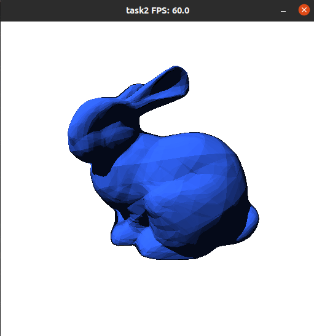

# Выбранный вариант - аппроксимация расстояния с помощью нейросетей

[репозитторий](https://github.com/shorohml/gpu_prog/tree/master/task2)

## 1 Обучение нейросети

### 1.1 Установка зависимостей

```
python3 -m venv venv && source venv/bin/activate && pip install -r requirements.txt
```

### 1.2 Запуск обучения

```
jupyter-lab
```

Затем открыть ноутбук train_sdf.ipynb и запустить все ячейки.

## 1. Детали сборки проекта.

Используемое API - CUDA + interop с OpenGL.

Порядок сборки:
```
mkdir build && cd build && cmake .. && make
```

## 2. Запуск приложения

Конфигурация приложения в файле config.json в корне

Запуск:
```
./main
```

Должно выглядеть примерно так:


##  3. Управление

- WASD - перемещение
- Стрелки - направление источника света
- 1 - отрисовка по умолчанию
- 2 - визуализация буфера глубины
- 3 - визуализация нормалей (цветом)

## 4. Выполненные пункты задания

Все пункты
